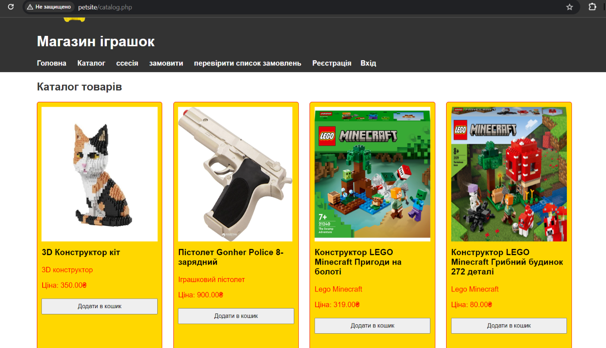
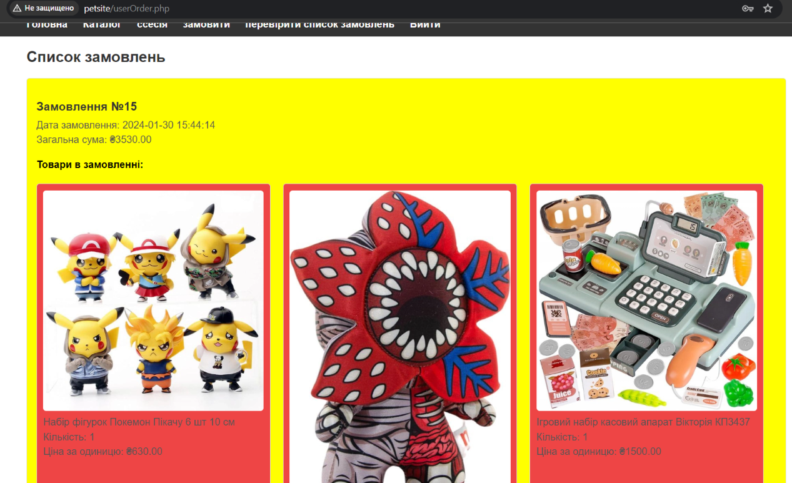

# PHP MySQL Site

This website is a small online store. Unregistered users can browse the catalog of products and add them to the cart. To place an order it is necessary to log in or register. After that, the user can go to the checkout.php page, where they provide their details and confirm the order. In addition, on the userOrder.php page the user can view general information about his order.

**product catalog page**

**user order view page**

for this site is used MySQL in it stores data about the user, goods, and data about the order that the user has placed.

[website link](http://toyshoptest.free.nf/index.php)

you can run the site locally using openServer where this build is used:
+ HTTP - Apache_2.4-PHP_7.2-7.4
+ PHP - PHP_7.3
+ MySQL/MariaDB - MySQL -8.0-Win10

**Demonstration of the site on video**

https://github.com/vovaorangecat/My_Studies/assets/95964614/469c9e81-452d-4e07-86d2-ff0991b450d7
